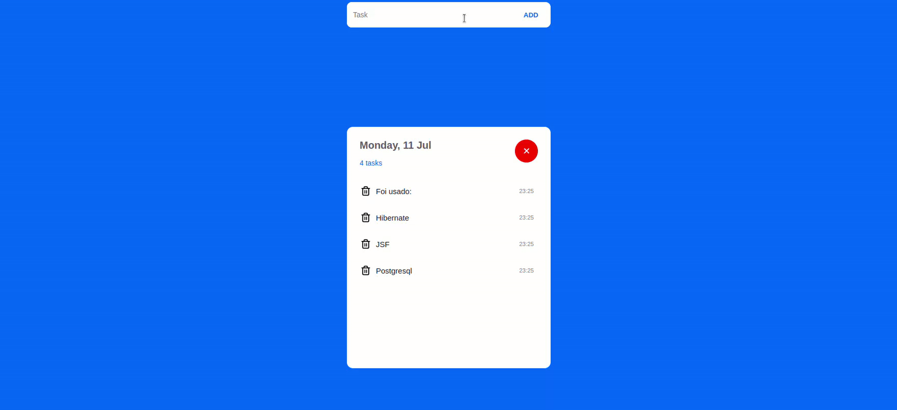

# ToDoList
simple annotation project, using PostgreSQL database to save annotations

### First Steps
- `git clone` in the project
- run update on maven project
- configure in eclipse the `build path` and compiler version for `Java 17.0.3`
- configure `deployment assembly` for maven dependencies
- configure the `persistence.xml` file for your database
- mount tomcat with project and upload

---

### Task
- [x] Create Front-End (JSF)
- [x] Create ManagedBean
- [x] Create Entities and Connection with DataBase
